# Illustrator

[简体中文](./README.md) | [English](./README.en.md)

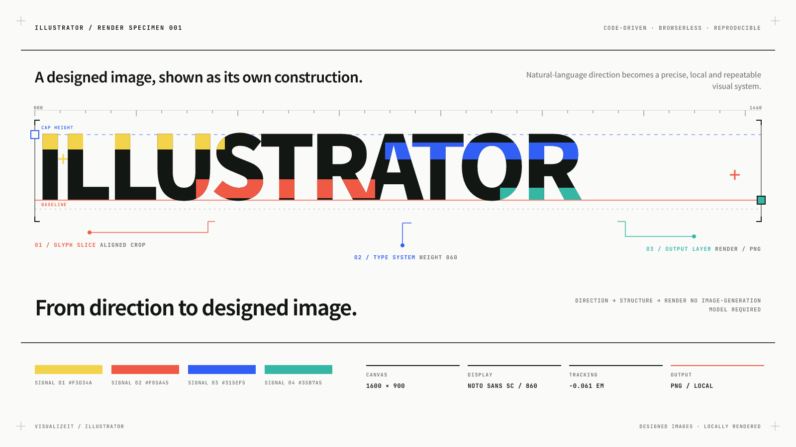

**Designed images from a regular code-capable LLM—no image-generation model required.**

Illustrator is a lightweight, browserless Agent Skill that turns natural-language direction, content, code, and supplied images into designed visuals through local rendering. Start from the bundled examples or define a visual style entirely your own.

> **Project article (Chinese):**
> [Design rationale, usage, and real-world examples](https://mp.weixin.qq.com/s/Wi4zC5eW3RerVuToagChwQ)

## Why Illustrator

- **No image-generation model** — a regular code-capable LLM can create visuals by generating local rendering code.
- **Lightweight and browserless** — no Chromium, Puppeteer, or browser runtime.
- **Examples included, styles unrestricted** — use the bundled examples as references or bring your own visual direction.
- **Code-driven and locally rendered** — visuals are produced through generated rendering code rather than a black-box image model.

## What You Can Create

- Editorial illustrations and posters
- Article and social media visuals
- Photo-led compositions using supplied images
- Data-led reports and information graphics
- Code snippets, windows, and diffs
- Fully custom visual systems

## Install

Requires Node.js 20 or newer and an Agent Skills-compatible coding agent.

```sh
npx skills add Visualizeit/illustrator --skill illustrator
```

## Usage

After installation, describe the visual you want to your agent:

```text
/illustrator Create a 1600×900 editorial illustration about focus and deep work.
```

```text
/illustrator Redesign this content using the bundled Flash Diary example as a visual reference.
```

```text
/illustrator Turn this code into a clean, presentation-ready image.
```

## Examples

Bundled examples include their rendering source, assets, and output previews, making them easy to inspect, modify, and render again.

### Illustration & Editorial

#### [System Layers Cover](./skills/illustrator/examples/system-layers-cover)

A square technical-article cover that turns Prompt, Context, Agent, Permission, and Shell into one layered system.

**Published use:** [为什么我不推荐使用 OpenCode](https://mp.weixin.qq.com/s/YQVcEe0CJz2Ki57q5eaM8Q), a WeChat article whose cover and seven inline visuals were rendered locally with Illustrator.

<p align="center">
  <a href="./skills/illustrator/examples/system-layers-cover">
    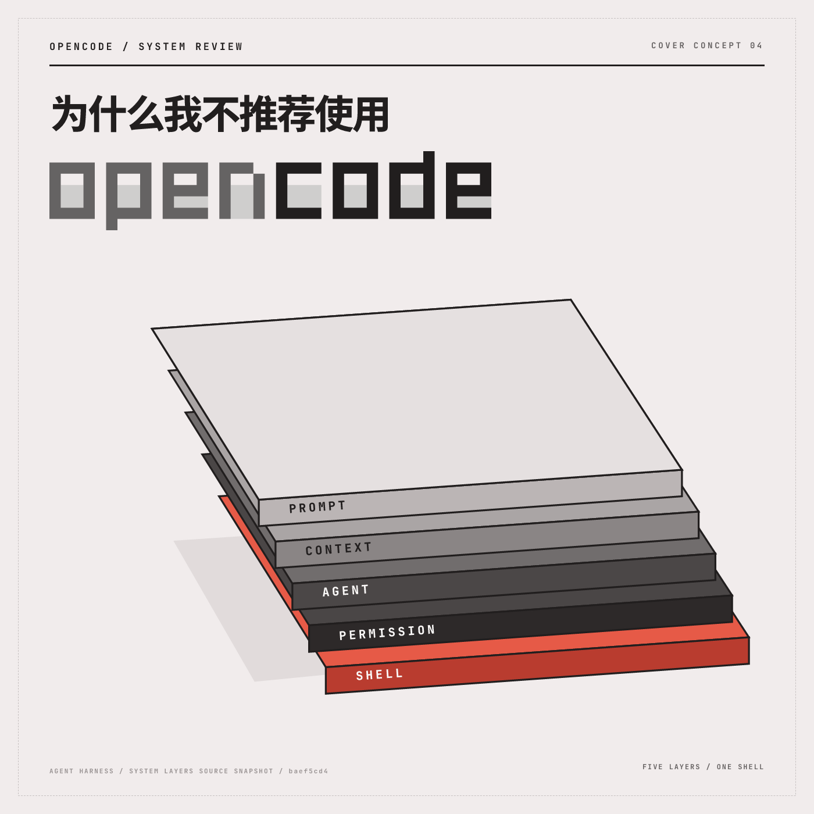
  </a>
</p>

#### [Flash Diary](./skills/illustrator/examples/flash-diary)

A bright, photo-led city diary built from supplied imagery, bold type, and compact editorial details.

<p align="center">
  <a href="./skills/illustrator/examples/flash-diary">
    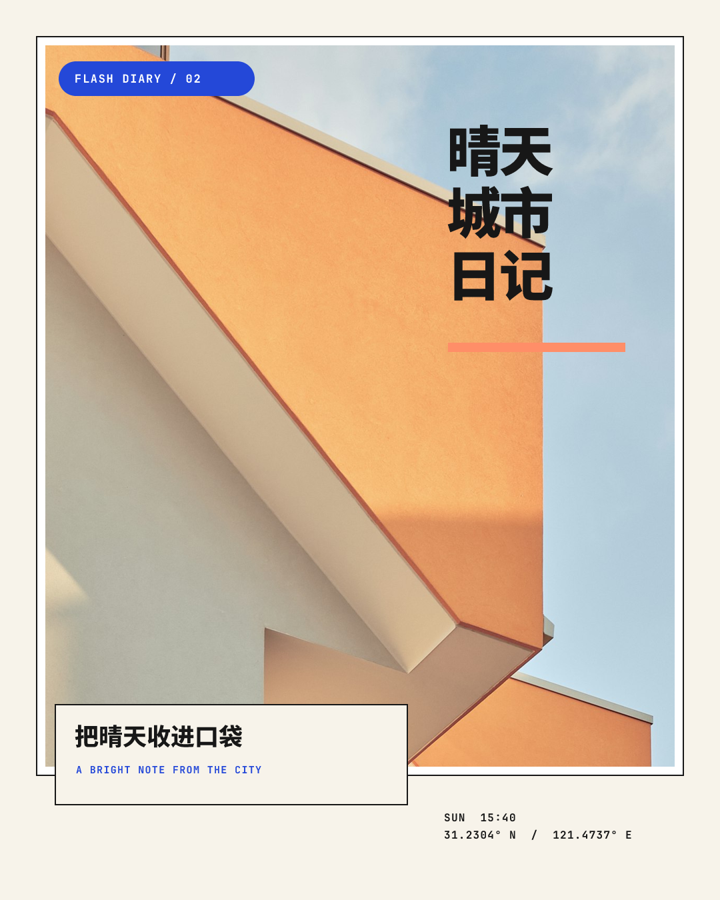
  </a>
</p>

#### [Flower Market](./skills/illustrator/examples/flower-market)

A colorful market poster combining oversized typography with crisp geometric flowers.

<p align="center">
  <a href="./skills/illustrator/examples/flower-market">
    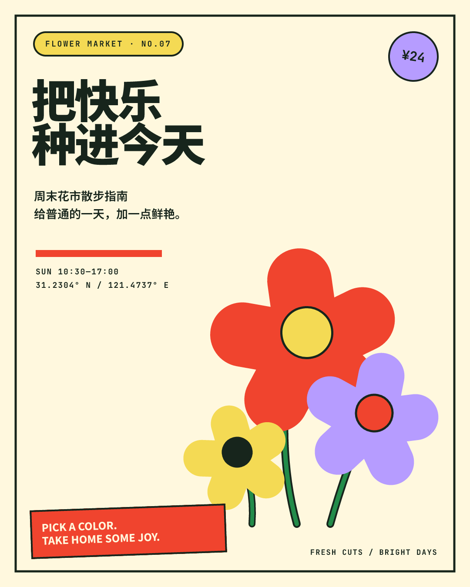
  </a>
</p>

#### [Field Archive](./skills/illustrator/examples/field-archive)

A contemporary specimen study shaped by natural forms, measured annotations, and catalog metadata.

<p align="center">
  <a href="./skills/illustrator/examples/field-archive">
    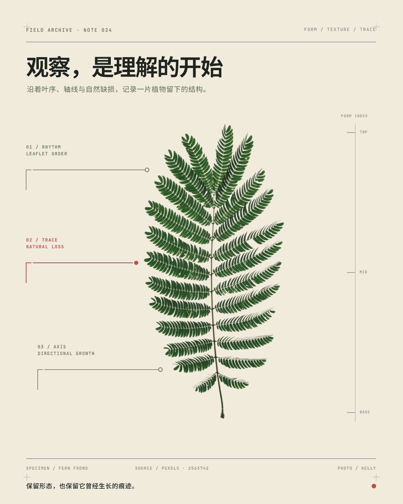
  </a>
</p>

#### [Render Specimen](./skills/illustrator/examples/render-specimen)

A typographic specimen that turns the ILLUSTRATOR wordmark into its own measured, color-coded construction.

<p align="center">
  <a href="./skills/illustrator/examples/render-specimen">
    
  </a>
</p>

#### [Paddock Blue](./skills/illustrator/examples/paddock-blue)

A restrained motorsport editorial combining motion photography with compact performance data.

<p align="center">
  <a href="./skills/illustrator/examples/paddock-blue">
    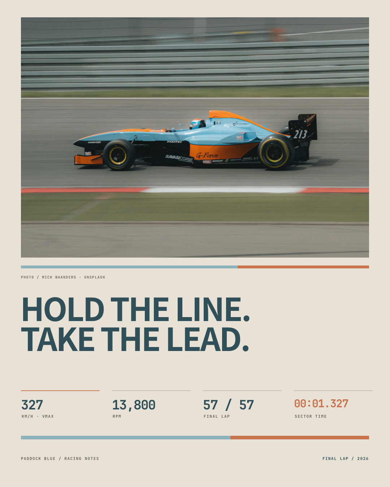
  </a>
</p>

#### [Grid Operator](./skills/illustrator/examples/grid-operator)

A landscape automation visual built around a semantic spreadsheet and one precise interaction.

<p align="center">
  <a href="./skills/illustrator/examples/grid-operator">
    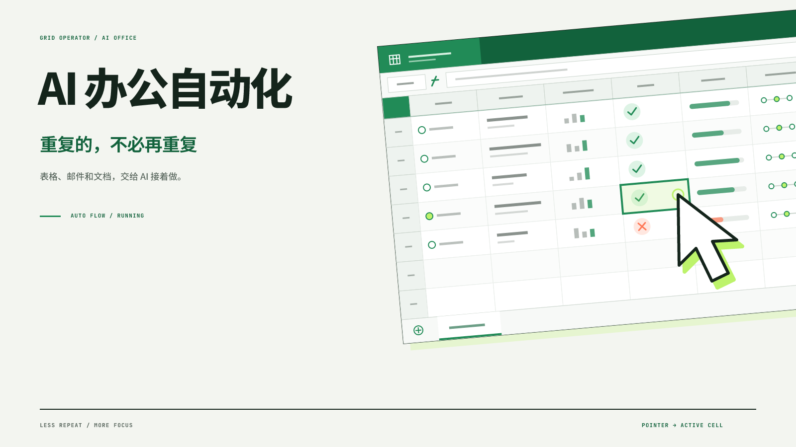
  </a>
</p>

#### [Refraction Atlas](./skills/illustrator/examples/refraction-atlas)

An analytical report visual using crisp comparison lines and overlapping translucent fields.

<p align="center">
  <a href="./skills/illustrator/examples/refraction-atlas">
    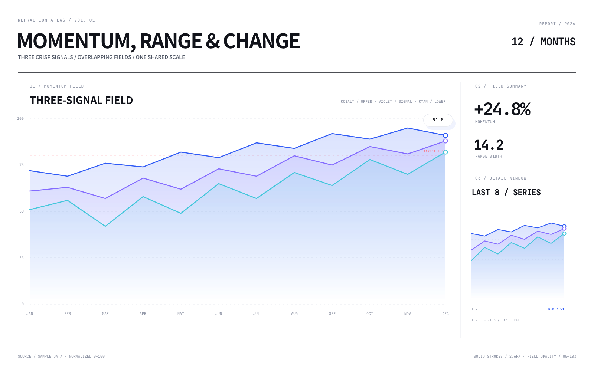
  </a>
</p>

#### [Chromatic Poster](./skills/illustrator/examples/chromatic-poster)

A minimal color-study poster with one dominant field and concise editorial typography.

<p align="center">
  <a href="./skills/illustrator/examples/chromatic-poster">
    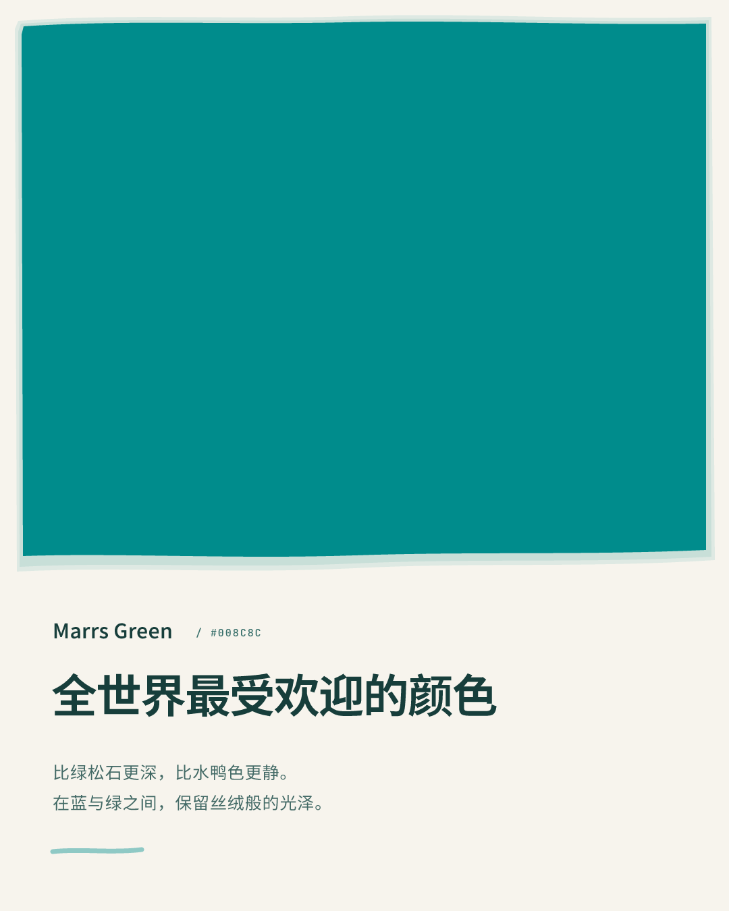
  </a>
</p>

### Code Images

#### [Shiki Code Diff](./skills/illustrator/examples/shiki-code-diff)

A presentation-ready split diff with syntax highlighting and clear added and removed regions.

<p align="center">
  <a href="./skills/illustrator/examples/shiki-code-diff">
    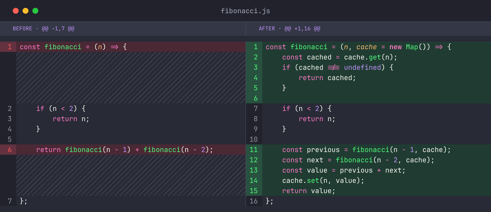
  </a>
</p>

#### [Shiki Code Window](./skills/illustrator/examples/shiki-code-window)

A light code window with compact file chrome and readable syntax highlighting.

<p align="center">
  <a href="./skills/illustrator/examples/shiki-code-window">
    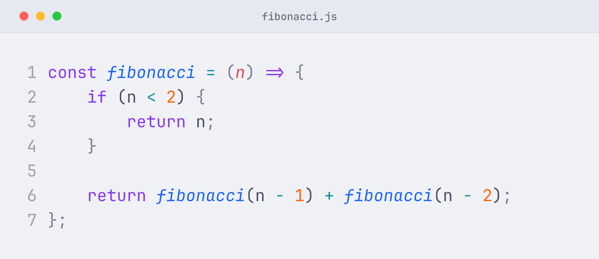
  </a>
</p>

#### [Shiki Code Image](./skills/illustrator/examples/shiki-code-image)

A minimal dark code image for documentation, articles, and social posts.

<p align="center">
  <a href="./skills/illustrator/examples/shiki-code-image">
    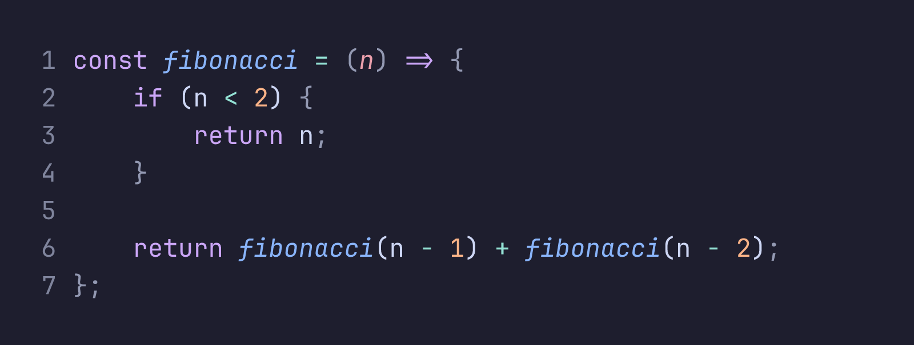
  </a>
</p>

## License

Copyright 2026 Visualizeit. Licensed under the [Apache License 2.0](./LICENSE); redistributions must retain the required license and attribution notices in [`NOTICE`](./NOTICE).

Using Illustrator does not by itself require attribution on generated images. Bundled fonts and example photographs remain under their respective terms; see [`THIRD_PARTY_NOTICES.md`](./skills/illustrator/THIRD_PARTY_NOTICES.md).

## Development

Requires Node.js and pnpm.

```sh
pnpm install
pnpm run validate
```

The Skill source lives in [`skills/illustrator`](./skills/illustrator). Noto Sans SC and JetBrains Mono are bundled for consistent text and code rendering; see [`THIRD_PARTY_NOTICES.md`](./skills/illustrator/THIRD_PARTY_NOTICES.md) for font and image sources.

> [!IMPORTANT]
> **Public alpha.** Illustrator is usable today, but its Skill interface and runtime packaging may change before v1.0.
